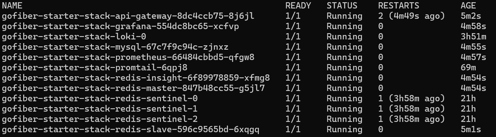
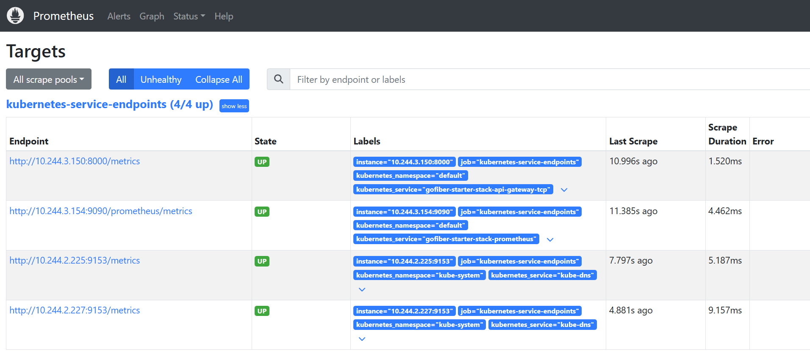
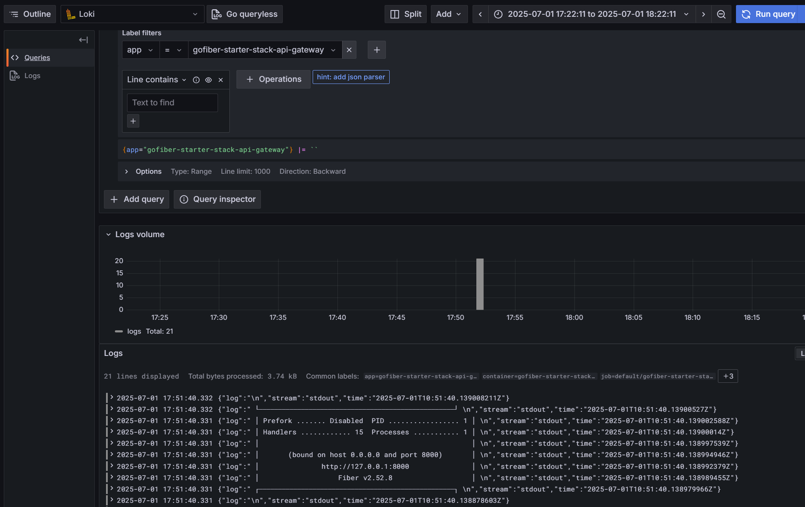
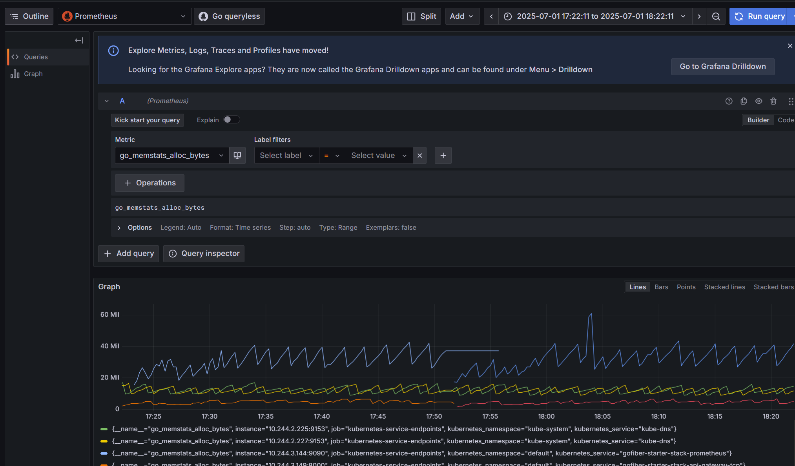

# Kubernetes/Helm Environment

☸️ Production-ready deployment environment using Kubernetes with Helm charts, featuring advanced monitoring, logging, and auto service discovery.

---

## 🚀 Features

- **Go Fiber API Gateway** - High-performance HTTP framework with built-in middleware and Swagger documentation
- **Redis Cluster** - Master-slave replication with Redis Sentinel for high availability
- **MySQL Database** - Relational database with GORM ORM integration
- **Comprehensive Monitoring Stack**:
  - **Prometheus** - Metrics collection with auto service discovery
  - **Grafana** - Data visualization and dashboards
  - **Loki & Promtail** - Centralized log aggregation and querying
- **Redis Insight** - Redis GUI for database management
- **Swagger Documentation** - Auto-generated API documentation
- **Prometheus Auto Service Discovery** - Automatic service monitoring
- **Ingress Controller** - Nginx-based routing and load balancing
- **Helm Charts** - Kubernetes package management

---

## 📋 Prerequisites

- Kubernetes cluster (minikube, kind, or cloud provider)
- Helm 3.x
- kubectl configured
- Ingress controller (nginx-ingress recommended)

---

## 🏗️ Architecture

```
┌─────────────────┐    ┌─────────────────┐    ┌─────────────────┐
│   API Gateway   │    │     Grafana     │    │   Prometheus    │
│   (Go Fiber)    │    │   (Port 3000)   │    │   (Port 9090)   │
│   (Port 8000)   │    │                 │    │                 │
└─────────────────┘    └─────────────────┘    └─────────────────┘
         │                       │                       │
         └───────────────────────┼───────────────────────┘
                                 │
         ┌─────────────────────────────────────────────────┐
         │              Redis Cluster                      │
         │  ┌─────────┐ ┌─────────┐ ┌─────────┐ ┌─────────┐ │
         │  │  Master │ │  Slave  │ │Sentinel1│ │Sentinel2│ │
         │  │ (6379)  │ │ (6379)  │ │ (26379) │ │ (26380) │ │
         │  └─────────┘ └─────────┘ └─────────┘ └─────────┘ │
         │                    │                    │         │
         │              ┌─────────┐         ┌─────────┐     │
         │              │Sentinel3│         │Redis    │     │
         │              │(26381)  │         │Insight  │     │
         │              └─────────┘         │(5540)   │     │
         └──────────────────────────────────┴─────────┴─────┘
                                 │
         ┌─────────────────────────────────────────────────┐
         │              MySQL Database                     │
         │              (Port 3306)                        │
         └─────────────────────────────────────────────────┘

         ┌─────────────────────────────────────────────────┐
         │              Loki & Promtail                   │
         │              (Log Aggregation)                 │
         │  ┌─────────┐ ┌─────────┐ ┌─────────┐           │
         │  │  Loki   │ │Promtail1│ │Promtail2│           │
         │  │ (3100)  │ │         │ │         │           │
         │  └─────────┘ └─────────┘ └─────────┘           │
         └─────────────────────────────────────────────────┘
```

---

## 🚀 Quick Start

1. **Clone the repository**
   ```bash
   git clone https://github.com/XDcobra/gofiber-starter-stack.git
   cd gofiber-starter-stack
   ```

2. **Set up Kubernetes cluster (if needed)**
   2.1. **Setup Kubernetes cluster with Minikube**
   ```bash
      # Using minikube
      minikube start
   
      # Install local repository
      minikube addons enable registry
   
      # Port-forwarding to Port 5000
      kubectl port-forward --namespace kube-system service/registry 5000:80
   
      # Redirect traffic
      docker run --rm -it --network=host alpine ash -c "apk add socat && socat TCP-LISTEN:5000,reuseaddr,fork TCP:host.docker.internal:5000"
      ```
   2.2. **Setup Kubernetes cluster with Kind**
   ```bash
   # Using kind
   kind create cluster
   ```

   2.3. **Setup Kubernetes cluster with Docker Desktop**
   ```bash
      # Using Docker Desktop
      # Enable Kubernetes in Docker Desktop settings
   ```

3. **Install nginx-ingress controller**
   ```bash
   helm repo add ingress-nginx https://kubernetes.github.io/ingress-nginx
   helm repo update
   helm install nginx-ingress ingress-nginx/ingress-nginx
   ```

4. **Deploy the application**
   ```bash
   cd charts/gofiber-starter-stack
   helm install gofiber-starter-stack .
   ```
   
5. **Build API-Gateway image**
   ```bash
   # Because the api-gateway image is not available on github, we need to build it locally
   docker-compose build
   # If using minikube local registry push the image to the local registry
   docker push localhost:5000/api-gateway:latest
   # Then you can easily pull it in your values.yaml file like this
   repository: localhost:5000/api-gateway
   ```

6. **Access the services**
   - API Gateway: http://localhost/api
   - Swagger Documentation: http://localhost/api/swagger
   - Grafana: http://localhost/grafana
   - Prometheus: http://localhost/prometheus (if enabled in ingress)
   - Redis Insight: Available via port-forward (or enabled in ingress)

7. **Port forwarding for direct access**
   ```bash
   # API Gateway
   kubectl port-forward svc/gofiber-starter-stack-api-gateway-tcp 8000:8000
   
   # Grafana
   kubectl port-forward svc/gofiber-starter-stack-grafana 3000:3000
   
   # Prometheus
   kubectl port-forward svc/gofiber-starter-stack-prometheus 9090:9090
   
   # Redis Insight
   kubectl port-forward svc/gofiber-starter-stack-redis-insight 5540:5540
   ```

8. **Check if ports are running**
<p align="center">

</p>

   ```bash
   kubectl get pods
   ```
---

## 📁 Chart Structure

```
charts/gofiber-starter-stack/
├── Chart.yaml                    # Chart metadata and dependencies
├── values.yaml                   # Default configuration values
├── secret-values.yaml            # Secret configuration template
├── .helmignore                   # Files to ignore during packaging
├── charts/                       # Chart dependencies
│   └── loki-stack-2.10.2.tgz    # Loki stack dependency
├── files/                        # Static files
│   └── mysql-init.sql           # MySQL initialization script
└── templates/                    # Kubernetes manifests
    ├── api-gateway/             # API Gateway deployment
    ├── grafana/                 # Grafana configuration
    ├── ingress/                 # Ingress rules
    ├── mysql/                   # MySQL database
    ├── prometheus/              # Prometheus monitoring
    ├── redis/                   # Redis cluster
    └── secrets/                 # Secret management
```

---

## 🔧 Configuration

### Values.yaml Configuration

The main configuration file `values.yaml` allows you to customize:

```yaml
# API Gateway configuration
apiGateway:
  replicaCount: 1
  image:
    repository: localhost:5000/api-gateway
    tag: latest
  service:
    type: LoadBalancer
    port: 8000

# Redis cluster configuration
redis:
  replicaCount: 1
  slave:
    replicaCount: 1
  sentinel:
    replicaCount: 3
    quorum: 2

# Ingress configuration
ingress:
  enabled: true
  className: nginx
  host: localhost
  rewritePaths:
    - path: /api$
      service:
        name: api-gateway-tcp
        port: 8000

# Loki stack configuration
loki-stack:
  loki:
    enabled: true
  promtail:
    enabled: true
  grafana:
    enabled: false  # Using our own Grafana instance
```

### Environment-Specific Configuration

Create environment-specific value files:

```bash
# Development
helm install gofiber-starter-stack . -f values-dev.yaml

# Production
helm install gofiber-starter-stack . -f values-prod.yaml
```

---

## 🔧 API Endpoints

### Health Check
- `GET /api/` - API health check

### Redis Operations
- `GET /api/redis/ping` - Redis connection test
- `GET /api/redis/get` - Get value from Redis
- `POST /api/redis/post` - Set value in Redis

### MySQL Operations
- `GET /api/mysql/get/:id` - Get record by ID
- `POST /api/mysql/post` - Create new record

### Documentation & Monitoring
- `GET /api/swagger/*` - Swagger API documentation
- `GET /api/metrics` - Prometheus metrics endpoint

---

## 🔐 Authentication & Security

### Kubernetes Secrets

Secrets are managed through Kubernetes secrets and can be found in the [Secrets Folder](./gofiber-starter-stack/templates/secrets)

### Service Accounts

The chart creates service accounts for:
- Prometheus monitoring
- API Gateway
- Redis cluster management

### Network Policies

Consider implementing network policies for:
- Service-to-service communication
- External access control
- Database access restrictions
- Implementing RBAC

### Authentication

❗ Even if docker-compose has BasicAuth for prometheus /metrics Endpoint
as well as API-Gateway /metrics endpoint, these endpoints are not protected in the helm
configuration. So consider to secure them via any other authentification system like RBAC

---

## 📊 Monitoring & Observability

### Prometheus Auto Service Discovery
<p align="center">

</p>

Prometheus automatically discovers services using:
- **Kubernetes Service Discovery** - Automatically finds all services
- **Pod Annotations** - Custom metrics endpoints
- **Service Monitors** - Custom resource for service monitoring

### Loki & Promtail Log Aggregation
<p align="center">

</p>

- **Loki** - Centralized log storage and querying
- **Promtail** - Log collection and forwarding
- **Grafana Integration** - Unified logging and metrics dashboard

### Grafana Dashboards
<p align="center">

</p>

Pre-configured dashboards for:
- API Gateway performance
- Redis cluster health
- MySQL database metrics
- System resource usage
- Log analysis and correlation

---

## 🔄 Redis Cluster Configuration

The Redis setup includes:
- **Master-Slave Replication** for data redundancy
- **Redis Sentinel** for automatic failover
- **Redis Insight** for visual management
- **High Availability** with automatic master election
- **Kubernetes StatefulSets** for persistent storage

---

## 🗄️ Database Setup

### MySQL
- **Persistent Volume Claims** for data persistence
- **ConfigMap** for initialization scripts
- **Secret management** for credentials
- **Connection pooling** and optimization

### Redis
- **StatefulSet** for stable network identities
- **Persistent storage** for data durability
- **Sentinel configuration** for high availability
- **Connection pooling** and automatic reconnection

---

## 🚀 Production Deployment

### 1. **Prepare Production Values**

```yaml
# values-prod.yaml
apiGateway:
  replicaCount: 3
  resources:
    requests:
      memory: "256Mi"
      cpu: "250m"
    limits:
      memory: "512Mi"
      cpu: "500m"

redis:
  replicaCount: 3
  slave:
    replicaCount: 2
  sentinel:
    replicaCount: 5
    quorum: 3

mysql:
  replicaCount: 1
  persistence:
    size: 10Gi

ingress:
  annotations:
    cert-manager.io/cluster-issuer: "letsencrypt-prod"
  tls:
    - secretName: gofiber-tls
      hosts:
        - your-domain.com
```

### 2. **Deploy with Production Configuration**

```bash
# Install with production values
helm install gofiber-starter-stack . -f values-prod.yaml

# Upgrade existing deployment
helm upgrade gofiber-starter-stack . -f values-prod.yaml
```

### 3. **Set up Monitoring and Alerting**

- Configure Grafana alerting rules
- Set up Prometheus alerting
- Implement log retention policies
- Configure backup strategies

### 4. **Security Hardening**

- Enable network policies
- Implement RBAC
- Use secrets management
- Configure TLS/SSL certificates
- Enable audit logging

---

## 🛠️ Development Commands

```bash
# Install the chart
helm install gofiber-starter-stack .

# Upgrade the chart
helm upgrade gofiber-starter-stack .

# Uninstall the chart
helm uninstall gofiber-starter-stack

# List releases
helm list

# Get release status
helm status gofiber-starter-stack

# View values
helm get values gofiber-starter-stack

# Template rendering (dry-run)
helm template gofiber-starter-stack .

# Lint the chart
helm lint .
```

---

## 🔍 Troubleshooting

### Common Issues

1. **Ingress not working**
   ```bash
   # Check ingress controller
   kubectl get pods -n ingress-nginx
   
   # Check ingress status
   kubectl describe ingress
   ```

2. **Services not accessible**
   ```bash
   # Check service endpoints
   kubectl get endpoints
   
   # Check pod status
   kubectl get pods
   ```

3. **Prometheus not discovering services**
   ```bash
   # Check service monitors
   kubectl get servicemonitors
   
   # Check Prometheus targets
   kubectl port-forward svc/prometheus 9090:9090
   # Then visit http://localhost:9090/targets
   ```

4. **Loki not receiving logs**
   ```bash
   # Check Promtail configuration
   kubectl get configmap -l app=promtail
   
   # Check Loki logs
   kubectl logs -l app=loki
   
   # Check if you forgot to change the 
   # .Values.loki-stack.promtail.config.clients.url value
   "http://your-project-name:3100/loki/api/v1/push"
   ```

### Logs and Debugging

```bash
# View all logs
kubectl logs -l app=gofiber-starter-stack

# Follow logs
kubectl logs -f deployment/api-gateway

# Execute commands in pods
kubectl exec -it deployment/api-gateway -- /bin/sh
```

---

## 🔗 Related Documentation

- **[Main README](../README.md)** - Overview of the entire project
- **[Docker Compose Documentation](../services/README.md)** - Local development environment
- **[Helm Documentation](https://helm.sh/docs/)** - Official Helm documentation
- **[Kubernetes Documentation](https://kubernetes.io/docs/)** - Official Kubernetes documentation

---

## 📝 License

This project is licensed under the MIT License - see the [LICENSE](../LICENSE) file for details.
